# Spring Boot DevSecOps Pipeline

A Product, Category, and Customer REST API delivered through a local, end-to-end DevSecOps pipeline. A developer commit is checked before it leaves the workstation; Jenkins then builds, tests, scans, analyzes, publishes, packages, deploys, and monitors the application.

## Architecture

```mermaid
flowchart LR
    C[Developer commit] -->|pre-commit hooks| G[Git / GitHub]
    G -->|push or webhook| M

    subgraph HOST[Host Docker]
      subgraph JK[Jenkins]
        M[Maven<br/>Build, test & coverage] --> S[Semgrep<br/>Static security scan]
        S --> TF[Trivy FS<br/>Dependency scan]
        TF --> Q[Maven / SonarQube<br/>Code-quality gate]
        Q --> N[Maven / Nexus<br/>Publish JAR]
        N --> D[Docker<br/>Multi-stage image build]
        D --> TI[Trivy Image<br/>Container image scan]
        TI --> H[Docker Hub<br/>Push versioned & latest image]
        H --> TC[Trivy Config<br/>IaC/config scan]
        TC --> A[Ansible<br/>Deploy application & monitoring]
      end
      SQ[SonarQube]
      NX[Nexus]
      Q --> SQ
      N --> NX

      subgraph MK[Minikube]
        K[Kubernetes<br/>Spring Boot application]
        P[Prometheus]
        GR[Grafana]
        K -->|/actuator/prometheus| P --> GR
      end
      A --> K
      A --> P
      A --> GR
    end
```



The Jenkins container, SonarQube, Nexus, and Minikube run locally. Jenkins connects to the host Docker socket to build and push images, and uses the exported kubeconfig to deploy to Minikube.

## DevSecOps phases and controls

| Phase | Implementation | What it provides |
|---|---|---|
| Plan / develop | Git and GitHub | Versioned source code and a push-triggered delivery workflow. |
| Commit security | `pre-commit` | Checks YAML, trailing whitespace, oversized additions, exposed private keys, Gitleaks secrets, and sensitive filenames before a commit is created. |
| Build and test | Maven + JUnit + JaCoCo | `mvn clean verify` compiles the Java 17 application, runs tests, and generates coverage data. |
| Static application security testing (SAST) | Semgrep | `semgrep scan --config auto --error .` runs in Jenkins and stops the pipeline on findings. |
| Software composition analysis (SCA) | Trivy FS | Scans repository dependencies, including `pom.xml`, for HIGH and CRITICAL vulnerabilities; HTML and JSON reports are retained in Jenkins. |
| Code quality | SonarQube | Maven submits analysis and coverage; Jenkins waits for the configured quality gate and fails if it does not pass. |
| Artifact management | Nexus Repository | Maven publishes the versioned JAR to the snapshots or releases repository. |
| Containerize and release | Docker + Docker Hub | A multi-stage Dockerfile produces a non-root Java 17 runtime image. Jenkins pushes the build-number tag and `latest`. |
| Container image security | Trivy Image | Scans the built image for HIGH and CRITICAL vulnerabilities before it can be pushed; HTML and JSON reports are retained in Jenkins. |
| IaC/config security | Trivy Config | Reports HIGH and CRITICAL configuration findings in `k8s/` and `ansible/`; HTML and JSON reports are retained in Jenkins. |
| Deploy | Ansible + Kubernetes / Minikube | Ansible renders the image tag, applies the app manifests, deploys monitoring, and waits for the rollout. |
| Operate and monitor | Spring Boot Actuator + Prometheus + Grafana | Prometheus scrapes application metrics; Grafana provides the application dashboard. |

### Local commit checks

Install the hooks once after cloning:

```bash
python3 -m pip install pre-commit
pre-commit install
pre-commit run --all-files
```

The hook configuration is in [`.pre-commit-config.yaml`](.pre-commit-config.yaml). Hooks prevent unsafe commits but are not a substitute for CI: Semgrep and SonarQube run again in Jenkins after code is pushed. If an intentional exception is required, fix or formally review the finding instead of routinely bypassing a hook with `--no-verify`.

## Pipeline sequence

The pipeline is defined in [`Jenkinsfile`](Jenkinsfile) and runs in this order:

1. Build, test, and collect coverage with Maven.
2. Scan the repository with Semgrep.
3. Run the Trivy filesystem dependency scan and retain HTML and JSON reports.
4. Submit quality and coverage analysis to SonarQube; wait for its quality gate.
5. Publish the Maven artifact to Nexus.
6. Build the Docker image using a multi-stage Dockerfile.
7. Scan the image with Trivy; HIGH and CRITICAL findings stop the image from being pushed.
8. Push `<dockerhub-user>/springboot-devops:<jenkins-build-number>` and `:latest` to Docker Hub.
9. Run the report-only Trivy configuration scan for `k8s/` and `ansible/`.
10. Run Ansible to deploy that exact image tag to Minikube, then apply Prometheus and Grafana.

Any failed stage stops the later stages, so an image is not built, published, or deployed after a failed test, Semgrep scan, Trivy image scan, or SonarQube gate.

## Security reports

Each Jenkins build retains Trivy HTML and JSON reports under **Build → Artifacts**. The Jenkins build page also provides **Trivy FS Scan**, **Trivy Image Scan**, and **Trivy Config Scan** links from the HTML Publisher plugin for viewing the HTML reports in the UI.

## Repository layout

```text
├── src/                     Spring Boot CRUD API, tests, Actuator metrics
├── pom.xml                  Maven, JaCoCo, SonarQube, and Nexus settings
├── Dockerfile               Multi-stage, non-root runtime image
├── Jenkinsfile              CI/CD and security pipeline
├── .pre-commit-config.yaml  Developer-side quality and secret checks
├── .trivyignore             Reviewed Trivy vulnerability exceptions
├── scripts/                 Custom sensitive-file-name hook
├── ci/                      Maven settings used for Nexus publishing
├── infra/                   Docker Compose, Jenkins image, JCasC, setup helpers
├── ansible/                 Kubernetes deployment playbook
└── k8s/                     Application and monitoring manifests
```

## Prerequisites

- Docker and Docker Compose
- Minikube with the Docker driver, `kubectl`, and Git
- A GitHub repository and Docker Hub repository/account
- Python 3 for local pre-commit hooks
- Approximately 10 GB RAM available for Minikube, Jenkins, SonarQube, and Nexus

On Windows, use Git Bash or WSL for the shell commands.

## One-time setup

### 1. Push the project to GitHub

Create an empty public repository named `springboot-devops`, then configure the remote:

```bash
git init
git add .
git commit -m "Initial commit"
git branch -M main
git remote add origin https://github.com/YOUR_USER/springboot-devops.git
git push -u origin main
```

### 2. Enable local commit protections

```bash
python3 -m pip install pre-commit
pre-commit install
```

### 3. Start Minikube and export access for Jenkins

Minikube must be running before Jenkins, because Jenkins joins its Docker network.

```bash
minikube start --driver=docker --cpus=2 --memory=4096
./infra/export-kubeconfig.sh
```

### 4. Configure local credentials

```bash
cd infra
cp .env.example .env
```

Set `GIT_REPO_URL`, `DOCKERHUB_USER`, `DOCKERHUB_TOKEN`, `SONAR_TOKEN`, and `NEXUS_PASSWORD` in `infra/.env`. Do not commit this file.

### 5. Start SonarQube and Nexus

```bash
docker compose up -d sonarqube nexus
```

Wait for both services to start. Then:

- SonarQube: open <http://localhost:9000>, sign in with `admin/admin`, change the password, and create a token under **My Account → Security**.
- Nexus: retrieve its initial password with `docker exec nexus cat /nexus-data/admin.password`, then open <http://localhost:8081>, sign in as `admin`, and set a new password.

Add the generated values to `infra/.env`.

### 6. Start Jenkins and run the delivery pipeline

```bash
docker compose up -d --build jenkins
```

Open <http://localhost:8080> and sign in using the Jenkins credentials in `infra/.env` (the example defaults are `admin` / `admin123`). The `springboot-devops` job and its credentials are created through Jenkins Configuration as Code. Run **Build Now** once; subsequent pushes are detected by a GitHub webhook when configured, or by polling approximately every two minutes.

For immediate GitHub-triggered builds outside a publicly reachable network, expose Jenkins (for example, with `ngrok http 8080`) and add `https://<public-url>/github-webhook/` as a GitHub webhook.

## Working locally

```bash
mvn spring-boot:run             # application: http://localhost:8080
mvn clean verify                # build, tests, and JaCoCo coverage
docker build -t springboot-devops .
docker run --rm -p 8080:8080 springboot-devops
```

To run the pre-commit suite without creating a commit:

```bash
pre-commit run --all-files
```

## Using the deployed stack

```bash
minikube service springboot-app -n devops --url
minikube service prometheus -n monitoring --url
minikube service grafana -n monitoring --url
```

- Jenkins: <http://localhost:8080>
- SonarQube: <http://localhost:9000>
- Nexus: <http://localhost:8081>
- Grafana credentials: `admin` / `admin`

Useful checks:

```bash
kubectl get all -n devops
kubectl logs -f deploy/springboot-app -n devops
kubectl rollout status deployment/springboot-app -n devops
kubectl rollout undo deployment/springboot-app -n devops
```

To deploy an existing Docker Hub tag manually:

```bash
ansible-playbook -i ansible/inventory.ini ansible/deploy.yml \
  -e image=YOUR_USER/springboot-devops -e tag=12
```

## API

| Method | Endpoint | Example request body |
|---|---|---|
| GET | `/` | — |
| GET, POST | `/api/products` | `{"name":"Mouse","price":25.5}` |
| GET, PUT, DELETE | `/api/products/{id}` | `{"name":"Mouse","price":30}` |
| GET, POST | `/api/categories` | `{"name":"Office","description":"Work supplies"}` |
| GET, PUT, DELETE | `/api/categories/{id}` | `{"name":"Office","description":"Updated description"}` |
| GET, POST | `/api/customers` | `{"firstName":"Ava","lastName":"Martin","email":"ava@example.com"}` |
| GET, PUT, DELETE | `/api/customers/{id}` | `{"firstName":"Ava","lastName":"Martin","email":"ava@example.com"}` |
| GET | `/actuator/health`, `/actuator/prometheus` | — |

The H2 database is created in memory at startup. When running locally, inspect it at <http://localhost:8080/h2-console> using `jdbc:h2:mem:productsdb`, user `sa`, and no password.

## Monitoring

Prometheus automatically scrapes pods annotated with `prometheus.io/scrape: "true"`. In Prometheus, try:

```text
http_server_requests_seconds_count
jvm_memory_used_bytes{area="heap"}
rate(http_server_requests_seconds_count[1m])
```

Grafana includes a Spring Boot application dashboard. Generate traffic to populate it:

```bash
URL=$(minikube service springboot-app -n devops --url)
for i in $(seq 200); do curl -s "$URL/api/products" > /dev/null; done
```

## Stop the environment

```bash
cd infra && docker compose down
minikube stop
```

Use `docker compose down -v` only when intentionally deleting Jenkins, SonarQube, and Nexus data. Use `minikube delete` only when intentionally deleting the entire cluster.

## Troubleshooting

| Issue | Resolution |
|---|---|
| Jenkins cannot reach Kubernetes | Run `./infra/export-kubeconfig.sh`, then restart Jenkins. |
| `network minikube not found` | Start Minikube before starting Docker Compose. |
| Nexus returns `401` | Correct `NEXUS_PASSWORD` in `infra/.env`, then recreate Jenkins configuration. |
| SonarQube or Semgrep stage fails | Review the Jenkins console output; address the finding or quality-gate condition before retrying. |
| Trivy stage fails | Check the Trivy report, update the base image or dependency, or add a reviewed exception to `.trivyignore`. |
| Trivy DB download fails or is slow | Confirm the persistent Trivy cache volume is present and Jenkins has network access to download the database. |
| `ImagePullBackOff` | Ensure the Docker Hub repository is public and `DOCKERHUB_USER` is correct. |
| SonarQube does not start on Linux | Run `sudo sysctl -w vm.max_map_count=524288`. |
