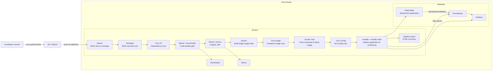

# Spring Boot DevSecOps Pipeline

A Product, Category, and Customer REST API delivered through a local, end-to-end DevSecOps pipeline. A developer commit is checked before it leaves the workstation; Jenkins then builds, tests, scans, analyzes, publishes, packages, deploys with encrypted secrets, monitors the application, and produces a report for every run.

## What's new

- **Ansible Vault** now protects deployment secrets. The Grafana admin password is encrypted in Git (`ansible/group_vars/all/vault.yml`), decrypted only at deploy time, and injected into Kubernetes as a `Secret` consumed through `secretKeyRef`. The hardcoded `admin/admin` is gone.
- **Vault password handled as a Jenkins credential** (`ansible-vault-pass`), created by Configuration as Code from `infra/.env`. The temporary password file used during the deploy stage is deleted on exit.
- **Per-run pipeline report**: `scripts/generate-report.py` builds a styled HTML summary (build info, vault check, Semgrep, SonarQube gate, Trivy counts, deployed pods) published as **Pipeline Report** on every build, even failed ones.
- **Semgrep results retained** as `reports/semgrep.json`; the SonarQube gate status is captured for the report.
- **Updated project tree and documentation**, including the DevSecOps phase breakdown below.

## Architecture



The Jenkins container, SonarQube, Nexus, and Minikube run locally. Jenkins connects to the host Docker socket to build and push images, and uses the exported kubeconfig to deploy to Minikube.

## DevSecOps implementation

Security is applied in three phases, each with its own tooling.

### Development phase

This phase has two sections.

**Pre-commit (before the commit exists): `pre-commit` hooks**

[pre-commit](https://pre-commit.com) is a framework that runs checks automatically on staged files when `git commit` is executed, and blocks the commit if a check fails. It is the earliest security control in the project, because problems are caught on the developer's machine before they reach Git history or GitHub. Configured hooks cover YAML validity, trailing whitespace, oversized file additions, exposed private keys, secrets detection with Gitleaks, and sensitive filenames (custom script `scripts/check-sensitive-filenames.sh`).

**Commit (CI): Semgrep**

[Semgrep](https://semgrep.dev) is a static application security testing (SAST) tool. It reads the source code without running it and matches patterns for vulnerabilities such as injection flaws, insecure configurations, and unsafe API usage. It runs in Jenkins as `semgrep scan --config auto --error .`, so any finding stops the pipeline, and results are saved to `reports/semgrep.json`. It acts as the server-side safety net for the local hooks, which can be bypassed.

### Acceptance phase

**Trivy**

[Trivy](https://trivy.dev) is an open-source scanner from Aqua Security. It is used in three modes:

| Mode | Target | Finds | Behavior |
|---|---|---|---|
| `trivy fs` | Repository dependencies (`pom.xml`) | Known vulnerabilities in libraries (SCA) | Report |
| `trivy image` | The built Docker image | HIGH and CRITICAL vulnerabilities in OS packages and the app | **Fails the build** before the image is pushed |
| `trivy config` | Kubernetes manifests, Ansible, Dockerfile | Misconfigurations (IaC scanning) | Report only |

HTML and JSON reports are archived for every build.

### Production phase

**Ansible Vault**

[Ansible Vault](https://docs.ansible.com/ansible/latest/vault_guide/index.html) encrypts sensitive variables with AES256 so they can be stored safely in Git. Here it protects the secrets used at deploy time:

- `ansible/group_vars/all/vault.yml` holds `vault_grafana_admin_password` and is committed only in encrypted form.
- Jenkins injects the vault password from the `ansible-vault-pass` credential into a temporary file that is deleted when the stage ends.
- The playbook creates a Kubernetes `Secret` (`grafana-admin`) with `no_log: true` so the value never appears in build logs.
- The Grafana Deployment reads the password through `secretKeyRef`; no plain-text password exists in any manifest.

**Known limits:** there is no automatic rotation or audit log, and Kubernetes Secrets are only base64-encoded unless etcd encryption is enabled. HashiCorp Vault or OpenBao is the production-grade upgrade path.

## DevSecOps phases and controls

| Phase | Implementation | What it provides |
|---|---|---|
| Plan / develop | Git and GitHub | Versioned source code and a push-triggered delivery workflow. |
| Pre-commit | `pre-commit` hooks | Checks YAML, trailing whitespace, oversized additions, exposed private keys, Gitleaks secrets, and sensitive filenames before a commit is created. |
| Build and test | Maven + JUnit + JaCoCo | `mvn clean verify` compiles the Java 17 application, runs tests, and generates coverage data. |
| Commit (SAST) | Semgrep | `semgrep scan --config auto --error .` runs in Jenkins and stops the pipeline on findings. |
| Acceptance (SCA) | Trivy FS | Scans repository dependencies, including `pom.xml`, for HIGH and CRITICAL vulnerabilities; HTML and JSON reports are retained in Jenkins. |
| Code quality | SonarQube | Maven submits analysis and coverage; Jenkins waits for the configured quality gate and fails if it does not pass. |
| Artifact management | Nexus Repository | Maven publishes the versioned JAR to the snapshots or releases repository. |
| Containerize and release | Docker + Docker Hub | A multi-stage Dockerfile produces a non-root Java 17 runtime image. Jenkins pushes the build-number tag and `latest`. |
| Acceptance (image) | Trivy Image | Scans the built image for HIGH and CRITICAL vulnerabilities before it can be pushed. |
| Acceptance (IaC/config) | Trivy Config | Reports HIGH and CRITICAL misconfigurations in Kubernetes manifests, Ansible, and the Dockerfile. |
| Production (secrets) | Ansible Vault | Encrypts deployment secrets in Git and delivers them to Kubernetes as `Secret` objects. |
| Deploy | Ansible + Kubernetes / Minikube | Renders the image tag, applies app manifests, creates secrets, deploys monitoring, and waits for the rollout. |
| Operate and monitor | Spring Boot Actuator + Prometheus + Grafana | Prometheus scrapes application metrics; Grafana provides the application dashboard. |
| Reporting | `generate-report.py` | A styled HTML summary of every run, published in Jenkins. |

### Local commit checks

Install the hooks once after cloning:

```bash
python3 -m pip install pre-commit
pre-commit install
pre-commit run --all-files
```

The hook configuration is in [`.pre-commit-config.yaml`](.pre-commit-config.yaml). Hooks prevent unsafe commits but are not a substitute for CI: Semgrep and SonarQube run again in Jenkins after code is pushed. If an intentional exception is required, fix or formally review the finding instead of routinely bypassing a hook with `--no-verify`.

## Pipeline sequence

The pipeline is defined in [`Jenkinsfile`](Jenkinsfile) and runs in this order:

1. Build, test, and collect coverage with Maven.
2. Scan the repository with Semgrep (JSON report retained).
3. Run the Trivy filesystem dependency scan and retain HTML and JSON reports.
4. Submit quality and coverage analysis to SonarQube; wait for its quality gate.
5. Publish the Maven artifact to Nexus.
6. Build the Docker image using a multi-stage Dockerfile.
7. Scan the image with Trivy; HIGH and CRITICAL findings stop the image from being pushed.
8. Push `<dockerhub-user>/springboot-devops:<jenkins-build-number>` and `:latest` to Docker Hub.
9. Run the report-only Trivy configuration scan (repository root, excluding `target/` and `infra/`).
10. Run Ansible with the vault password to create the Grafana Secret and deploy that exact image tag to Minikube, then apply Prometheus and Grafana.
11. Generate the **Pipeline Report** (runs on every build, including failures).

Any failed stage stops the later stages, so an image is not built, published, or deployed after a failed test, Semgrep scan, Trivy image scan, or SonarQube gate.

## Reports

Each Jenkins build retains these files under **Build → Artifacts**:

| File | Content |
|---|---|
| `pipeline-report.html` | Run summary: build result, duration, image, commit, vault encryption check, Semgrep, SonarQube gate, Trivy counts, deployed pods |
| `semgrep.json` | Semgrep findings |
| `trivy-fs.html` / `.json` | Dependency vulnerabilities |
| `trivy-image.html` / `.json` | Container image vulnerabilities |
| `trivy-config.html` / `.json` | IaC and configuration misconfigurations |

The build page also shows **Pipeline Report**, **Trivy FS Scan**, **Trivy Image Scan**, and **Trivy Config Scan** links from the HTML Publisher plugin.

Jenkins blocks inline CSS in HTML reports by default. `infra/docker-compose.yml` relaxes the `hudson.model.DirectoryBrowserSupport.CSP` setting so the styled reports render correctly.

Reports are generated in the Jenkins workspace, not in your local project folder. To copy them locally:

```bash
docker cp jenkins:/var/jenkins_home/workspace/springboot-devops/reports ./reports
```

`reports/` is not committed to Git (it is listed in `.gitignore`).

### Exceptions policy

Trivy vulnerability exceptions live in [`.trivyignore`](.trivyignore). Every entry must include a comment with the reason and a review date. Prefer fixing the dependency or base image over ignoring a finding.

## Repository layout

```text
├── src/                     Spring Boot CRUD API, tests, Actuator metrics
├── pom.xml                  Maven, JaCoCo, SonarQube, and Nexus settings
├── Dockerfile               Multi-stage, non-root runtime image
├── Jenkinsfile              CI/CD and security pipeline
├── .pre-commit-config.yaml  Developer-side quality and secret checks
├── .trivyignore             Reviewed Trivy vulnerability exceptions
├── scripts/                 Sensitive-file-name hook and pipeline report generator
├── ci/                      Maven settings used for Nexus publishing
├── infra/                   Docker Compose, Jenkins image, JCasC, setup helpers
├── ansible/                 Deployment playbook and Ansible Vault secrets
└── k8s/                     Application and monitoring manifests
```

## Project tree

```text
springboot-devops/
├── .dockerignore
├── .gitignore
├── .pre-commit-config.yaml
├── .semgrepignore
├── .trivyignore
├── Dockerfile
├── Jenkinsfile
├── README.md
├── functionality.md
├── pom.xml
├── ansible/
│   ├── deploy.yml
│   ├── inventory.ini
│   └── group_vars/
│       └── all/
│           └── vault.yml          # encrypted with Ansible Vault
├── ci/
│   └── maven-settings.xml
├── infra/
│   ├── .env.example
│   ├── docker-compose.yml
│   ├── export-kubeconfig.sh
│   └── jenkins/
│       ├── Dockerfile
│       └── casc.yaml
├── k8s/
│   ├── app/
│   │   ├── deployment.yaml.j2
│   │   ├── namespace.yaml
│   │   └── service.yaml
│   └── monitoring/
│       ├── 00-namespace.yaml
│       ├── grafana.yaml
│       └── prometheus.yaml
├── scripts/
│   ├── check-sensitive-filenames.sh
│   └── generate-report.py         # per-run HTML pipeline report
├── src/
│   ├── main/
│   │   ├── java/
│   │   │   └── com/
│   │   │       └── example/
│   │   │           └── demo/
│   │   │               ├── DemoApplication.java
│   │   │               ├── HomeController.java
│   │   │               ├── SampleDataInitializer.java
│   │   │               ├── controller/
│   │   │               │   ├── CategoryController.java
│   │   │               │   ├── CustomerController.java
│   │   │               │   └── ProductController.java
│   │   │               ├── dto/
│   │   │               │   ├── ProductRequest.java
│   │   │               │   └── ProductResponse.java
│   │   │               ├── entity/
│   │   │               │   ├── Category.java
│   │   │               │   ├── Customer.java
│   │   │               │   └── Product.java
│   │   │               ├── exception/
│   │   │               │   ├── GlobalExceptionHandler.java
│   │   │               │   └── ResourceNotFoundException.java
│   │   │               ├── repository/
│   │   │               │   ├── CategoryRepository.java
│   │   │               │   ├── CustomerRepository.java
│   │   │               │   └── ProductRepository.java
│   │   │               └── service/
│   │   │                   ├── CategoryService.java
│   │   │                   ├── CustomerService.java
│   │   │                   ├── ProductService.java
│   │   │                   └── impl/
│   │   │                       ├── CategoryServiceImpl.java
│   │   │                       ├── CustomerServiceImpl.java
│   │   │                       └── ProductServiceImpl.java
│   │   └── resources/
│   │       └── application.properties
│   └── test/
│       └── java/
│           └── com/
│               └── example/
│                   └── demo/
│                       └── ProductControllerTest.java
```

Local-only files that are **not** committed: `infra/.env`, `.vault_pass`, `infra/jenkins/kubeconfig`, `reports/`, `target/`.

## Prerequisites

- Docker and Docker Compose
- Minikube with the Docker driver, `kubectl`, and Git
- A GitHub repository and Docker Hub repository/account
- Python 3 for local pre-commit hooks
- Ansible with the `kubernetes.core` collection and Python `kubernetes` package for manual deploys (already included in the Jenkins image)
- Approximately 10 GB RAM available for Minikube, Jenkins, SonarQube, and Nexus

On Windows, use Git Bash or WSL for the shell commands.

## One-time setup

### 1. Push the project to GitHub

Create an empty public repository named `springboot-devops`, then configure the remote:

```bash
git init
git add .
git commit -m "Initial commit"
git branch -M main
git remote add origin https://github.com/YOUR_USER/springboot-devops.git
git push -u origin main
```

### 2. Enable local commit protections

```bash
python3 -m pip install pre-commit
pre-commit install
```

### 3. Start Minikube and export access for Jenkins

Minikube must be running before Jenkins, because Jenkins joins its Docker network.

```bash
minikube start --driver=docker --cpus=2 --memory=4096
./infra/export-kubeconfig.sh
```

### 4. Create the Ansible Vault

Generate a vault password and encrypt the secrets file. `.vault_pass` must stay out of Git (it is in `.gitignore`).

```bash
openssl rand -base64 32 > .vault_pass
mkdir -p ansible/group_vars/all
ansible-vault create ansible/group_vars/all/vault.yml --vault-password-file .vault_pass
```

In the editor, add:

```yaml
vault_grafana_admin_password: "choose-a-strong-password"
```

Verify and commit the encrypted file:

```bash
ansible-vault view ansible/group_vars/all/vault.yml --vault-password-file .vault_pass
git add ansible/group_vars/all/vault.yml
```

Edit it later with `ansible-vault edit ansible/group_vars/all/vault.yml --vault-password-file .vault_pass`. If `.vault_pass` is regenerated after encrypting, the file can no longer be decrypted and must be recreated.

### 5. Configure local credentials

```bash
cd infra
cp .env.example .env
```

Set `GIT_REPO_URL`, `GITHUB_USER`, `GITHUB_TOKEN`, `DOCKERHUB_USER`, `DOCKERHUB_TOKEN`, `SONAR_TOKEN`, `NEXUS_PASSWORD`, and `ANSIBLE_VAULT_PASS` in `infra/.env`. `ANSIBLE_VAULT_PASS` must equal the content of `.vault_pass`, with no quotes or trailing spaces. Do not commit this file.

### 6. Start SonarQube and Nexus

```bash
docker compose up -d sonarqube nexus
```

Wait for both services to start. Then:

- SonarQube: open <http://localhost:9000>, sign in with `admin/admin`, change the password, and create a token under **My Account → Security**.
- Nexus: retrieve its initial password with `docker exec nexus cat /nexus-data/admin.password`, then open <http://localhost:8081>, sign in as `admin`, and set a new password.

Add the generated values to `infra/.env`.

### 7. Start Jenkins and run the delivery pipeline

```bash
docker compose up -d --build jenkins
```

Open <http://localhost:8080> and sign in using the Jenkins credentials in `infra/.env` (the example defaults are `admin` / `admin123`; change them). The `springboot-devops` job and its credentials, including `ansible-vault-pass`, are created through Jenkins Configuration as Code. Run **Build Now** once; subsequent pushes are detected by a GitHub webhook when configured, or by polling approximately every two minutes.

For immediate GitHub-triggered builds outside a publicly reachable network, expose Jenkins (for example, with `ngrok http 8080`) and add `https://<public-url>/github-webhook/` as a GitHub webhook.

## Working locally

```bash
mvn spring-boot:run             # application: http://localhost:8080
mvn clean verify                # build, tests, and JaCoCo coverage
docker build -t springboot-devops .
docker run --rm -p 8080:8080 springboot-devops
```

To run the pre-commit suite without creating a commit:

```bash
pre-commit run --all-files
```

To generate the pipeline report locally from existing `reports/` files:

```bash
python3 scripts/generate-report.py   # writes reports/pipeline-report.html
```

## Using the deployed stack

```bash
minikube service springboot-app -n devops --url
minikube service prometheus -n monitoring --url
minikube service grafana -n monitoring --url
```

- Jenkins: <http://localhost:8080>
- SonarQube: <http://localhost:9000>
- Nexus: <http://localhost:8081>
- Grafana credentials: user `admin`, password = `vault_grafana_admin_password` from the vault (view it with `ansible-vault view`)

Grafana reads its admin password only at first startup. After changing it, restart the pod:

```bash
kubectl rollout restart deploy/grafana -n monitoring
```

Useful checks:

```bash
kubectl get all -n devops
kubectl logs -f deploy/springboot-app -n devops
kubectl rollout status deployment/springboot-app -n devops
kubectl rollout undo deployment/springboot-app -n devops
```

To deploy an existing Docker Hub tag manually:

```bash
ansible-playbook -i ansible/inventory.ini ansible/deploy.yml \
  --vault-password-file .vault_pass \
  -e image=YOUR_USER/springboot-devops -e tag=12
```

## API

| Method | Endpoint | Example request body |
|---|---|---|
| GET | `/` | — |
| GET, POST | `/api/products` | `{"name":"Mouse","price":25.5}` |
| GET, PUT, DELETE | `/api/products/{id}` | `{"name":"Mouse","price":30}` |
| GET, POST | `/api/categories` | `{"name":"Office","description":"Work supplies"}` |
| GET, PUT, DELETE | `/api/categories/{id}` | `{"name":"Office","description":"Updated description"}` |
| GET, POST | `/api/customers` | `{"firstName":"Ava","lastName":"Martin","email":"ava@example.com"}` |
| GET, PUT, DELETE | `/api/customers/{id}` | `{"firstName":"Ava","lastName":"Martin","email":"ava@example.com"}` |
| GET | `/actuator/health`, `/actuator/prometheus` | — |

The H2 database is created in memory at startup. When running locally, inspect it at <http://localhost:8080/h2-console> using `jdbc:h2:mem:productsdb`, user `sa`, and no password.

## Monitoring

Prometheus automatically scrapes pods annotated with `prometheus.io/scrape: "true"`. In Prometheus, try:

```text
http_server_requests_seconds_count
jvm_memory_used_bytes{area="heap"}
rate(http_server_requests_seconds_count[1m])
```

Grafana includes a Spring Boot application dashboard. Generate traffic to populate it:

```bash
URL=$(minikube service springboot-app -n devops --url)
for i in $(seq 200); do curl -s "$URL/api/products" > /dev/null; done
```

## Stop the environment

```bash
cd infra && docker compose down
minikube stop
```

Use `docker compose down -v` only when intentionally deleting Jenkins, SonarQube, and Nexus data. Use `minikube delete` only when intentionally deleting the entire cluster.

## Troubleshooting

| Issue | Resolution |
|---|---|
| Jenkins cannot reach Kubernetes | Run `./infra/export-kubeconfig.sh`, then restart Jenkins. |
| `network minikube not found` | Start Minikube before starting Docker Compose. |
| Nexus returns `401` | Correct `NEXUS_PASSWORD` in `infra/.env`, then recreate Jenkins configuration. |
| SonarQube or Semgrep stage fails | Review the Jenkins console output; address the finding or quality-gate condition before retrying. |
| Trivy stage fails | Check the Trivy report, update the base image or dependency, or add a reviewed exception (with reason and review date) to `.trivyignore`. |
| Trivy fixed version not found on Maven Central | Trivy's database can list fixes that are not yet published. Check Maven Central for the version before overriding it in `pom.xml`. |
| Trivy DB download fails or is slow | Confirm the persistent Trivy cache volume is present and Jenkins has network access to download the database. |
| Trivy reports not found locally | Reports live in the Jenkins workspace. Use **Build → Artifacts** or `docker cp` (see Reports). |
| `Decryption failed (no vault secrets were found...)` | The vault password does not match the one that encrypted `vault.yml`. Check `ansible-vault view` with `.vault_pass`; if it fails, recreate `vault.yml`. If it works, make sure `ANSIBLE_VAULT_PASS` in `infra/.env` is identical and recreate Jenkins (`docker compose up -d --force-recreate jenkins`). |
| `vault_grafana_admin_password is undefined` | `vault.yml` is missing from the pushed repository or lives outside `ansible/group_vars/all/`. |
| Grafana pod in `CreateContainerConfigError` | The `grafana-admin` Secret did not exist when Grafana was applied. Check the deploy order in `ansible/deploy.yml` (namespace, then Secret, then monitoring). |
| Pipeline Report has no styling | Confirm the `DirectoryBrowserSupport.CSP` option is set in `infra/docker-compose.yml` and Jenkins was recreated. |
| `ImagePullBackOff` | Ensure the Docker Hub repository is public and `DOCKERHUB_USER` is correct. |
| SonarQube does not start on Linux | Run `sudo sysctl -w vm.max_map_count=524288`. |