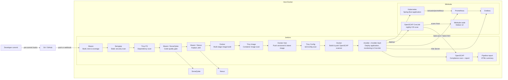

# Spring Boot DevSecOps Pipeline

A Product, Category, and Customer REST API delivered through a local, end-to-end DevSecOps pipeline. A developer commit is checked before it leaves the workstation; Jenkins then builds, tests, scans, analyzes, publishes, packages, deploys with encrypted secrets, monitors the application, audits the Kubernetes node against the CIS benchmark, and produces a report for every run.

## Architecture



The Jenkins container, SonarQube, Nexus, and Minikube run locally. Jenkins connects to the host Docker socket to build and push images, and uses the exported kubeconfig to deploy to Minikube.

## DevSecOps implementation

Security is applied in four phases, each with its own tooling.

### Development phase

This phase has two sections.

**Pre-commit (before the commit exists): `pre-commit` hooks**

[pre-commit](https://pre-commit.com) is a framework that runs checks automatically on staged files when `git commit` is executed, and blocks the commit if a check fails. It is the earliest security control in the project, because problems are caught on the developer's machine before they reach Git history or GitHub. Configured hooks cover YAML validity, trailing whitespace, oversized file additions, exposed private keys, secrets detection with Gitleaks, and sensitive filenames (custom script `scripts/check-sensitive-filenames.sh`).

The upstream SCAP datastream `compliance/ssg-debian12-ds.xml` (about 15 MB) is excluded from the file-content hooks, and allowlisted by path in `.gitleaks.toml`, because it is unmodified benchmark text that triggers false positives (for example the GRUB2 password rule description).

**Commit (CI): Semgrep as SAST**

[Semgrep](https://semgrep.dev) is a static application security testing (SAST) tool. It reads the source code without running it and matches patterns for vulnerabilities such as injection flaws, insecure configurations, and unsafe API usage. It runs in Jenkins as `semgrep scan --config auto --error .`, so any finding stops the pipeline, and results are saved to `reports/semgrep.json`. It acts as the server-side safety net for the local hooks, which can be bypassed.

### Acceptance phase

**Trivy: dependency, image and configuration scanning**

[Trivy](https://trivy.dev) is an open-source scanner from Aqua Security. It inspects artifacts and configuration files without running the application, so it covers software composition analysis (SCA), container image scanning and infrastructure-as-code scanning. It is not a DAST tool, because it does not attack a running application. It is used in three modes:

| Mode | Target | Finds | Behavior |
|---|---|---|---|
| `trivy fs` | Repository dependencies (`pom.xml`) | Known vulnerabilities in libraries (SCA) | Report |
| `trivy image` | The built Docker image | HIGH and CRITICAL vulnerabilities in OS packages and the app | **Fails the build** before the image is pushed |
| `trivy config` | Kubernetes manifests, Ansible, Dockerfiles | Misconfigurations (IaC scanning) | Report only |

HTML and JSON reports are archived for every build. Vulnerability exceptions live in `.trivyignore`, misconfiguration exceptions in `.trivyignore.yaml` (see [Exceptions policy](#exceptions-policy)).

### Production phase

**Ansible Vault: secrets management**

[Ansible Vault](https://docs.ansible.com/ansible/latest/vault_guide/index.html) encrypts sensitive variables with AES256 so they can be stored safely in Git. Here it protects the secrets used at deploy time:

- `ansible/group_vars/all/vault.yml` holds `vault_grafana_admin_password` and is committed only in encrypted form.
- Jenkins injects the vault password from the `ansible-vault-pass` credential into a temporary file that is deleted when the stage ends.
- The playbook creates a Kubernetes `Secret` (`grafana-admin`) with `no_log: true` so the value never appears in build logs.
- The Grafana Deployment reads the password through `secretKeyRef`; no plain-text password exists in any manifest.

**Known limits:** there is no automatic rotation or audit log, and Kubernetes Secrets are only base64-encoded unless etcd encryption is enabled. HashiCorp Vault or OpenBao is the production-grade upgrade path.

### Operation phase

**OpenSCAP: continuous compliance scanning**

[OpenSCAP](https://www.open-scap.org) checks a system's configuration against a compliance profile using SCAP content from the ComplianceAsCode project. It does not scan code or dependencies (Semgrep and Trivy do that). It adds an OS-level view: is the machine the workloads run on configured securely, and does that stay true over time?

**What is scanned.** The Minikube node (with the Docker driver, a containerized Debian 12 system), against **CIS Debian Benchmark Level 1 - Server** (`xccdf_org.ssgproject.content_profile_cis_level1_server`).

**How it runs.**

| Piece | Location | Role |
|---|---|---|
| Scanner image | `compliance/Dockerfile` | Debian 12 with `openscap-scanner`, the pinned datastream `ssg-debian12-ds.xml` (scap-security-guide 0.1.82), and the scripts below |
| Scan script | `compliance/scan.sh` | Runs `oscap xccdf eval` with `OSCAP_PROBE_ROOT=/host`, writes ARF and HTML reports, then `latest.html` and `latest.json`; keeps the 7 most recent runs |
| Summarizer | `compliance/summarize.py` | Counts rule results into JSON (parsed with `defusedxml`) |
| CronJob | `k8s/compliance/cronjob.yaml.j2` | Nightly at 02:00 in the `compliance` namespace; mounts the node's `/` read-only at `/host` and stores results in `/data/openscap` on the node |
| Pipeline stages | `Jenkinsfile` | Two stages: **Build & Push OpenSCAP Scanner** and **Compliance Scan (OpenSCAP)** (details below) |
| Deployment | `ansible/deploy.yml` | Renders and applies the CronJob; the scanner image is derived from the `image` variable |

**The two OpenSCAP pipeline stages.**

*Build & Push OpenSCAP Scanner* runs after Trivy Config Scan and before the Ansible deploy:

- Logs in to Docker Hub with the `dockerhub-creds` credential.
- Builds the image from `compliance/` (its own build context) and tags it `openscap-scanner:<build-number>` and `:latest`.
- Pushes both tags.
- It must run before the deploy, because Ansible renders the CronJob with this build's tag and the Minikube node pulls the image from Docker Hub.

*Compliance Scan (OpenSCAP)* runs after Deploy to Kubernetes (Ansible), as the last stage:

- Deletes any previous `oscap-run` Job, then creates a new one from the deployed `openscap-node-scan` CronJob. This runs the same scan as the nightly schedule, against the image from this build.
- Polls the Job every 10 seconds for up to 10 minutes. It stops early if the pod fails and prints the pod logs.
- Copies `latest.json` and `latest.html` out of the node with `docker exec minikube cat` (`docker cp` does not read `/data` on the node reliably) into `reports/openscap.json` and `reports/openscap.html`.
- Archives both files and publishes the HTML as **OpenSCAP Compliance Scan** on the build page. `generate-report.py` reads the JSON to add the score and counts to the Pipeline Report.
- Wrapped in `catchError`: if the scan cannot run, the build is marked `UNSTABLE` and not failed, because the application is already deployed and the Pipeline Report must still be generated. Failing compliance rules never fail the build (report-only policy).

**Continuity.** The CronJob scans every night at 02:00; the stage above adds a scan after every deployment.

**Score.** `pass / (pass + fail)`. Rules that are `notapplicable` (for example SSH server rules on a node without sshd), `notselected` (not part of the profile) or `notchecked` (need manual review) are excluded, so they do not distort the score. The Pipeline Report shows the score as green at or above 85 % (`OSCAP_MIN_SCORE` in `scripts/generate-report.py`) and red below. It is display only and never fails the build: the policy is **report only**.

**Baseline scan (first run).** 887 rules in the datastream: 126 pass, 12 fail, 261 not applicable, 4 not checked, 484 not selected. Score 91.3 %.

#### Reviewed findings

The 12 failing rules of the baseline scan were reviewed one by one. Only part of the CIS benchmark applies to a containerized node, and changes made inside the node disappear on `minikube delete`.

| Rule | Decision | Reason |
|---|---|---|
| `package_pam_pwquality_installed` | Accepted | The node has no password logins. Installing the package would also activate many password-quality rules that are not applicable today. |
| `use_pam_wheel_group_for_su` | Fix (`harden-node.sh`) | Restricts `su` to an empty group; `sudo` and `minikube ssh` are not affected. |
| `file_permission_user_init_files` | Fix (`harden-node.sh`) | `chmod` on user initialization files. |
| `file_permissions_home_directories` | Fix (`harden-node.sh`) | `chmod` on home directories. |
| `root_path_all_dirs`, `root_path_no_dot` | Unverified | No automatic fix exists. These may be false positives, depending on which PATH the scanner evaluates. |
| `accounts_umask_etc_bashrc`, `accounts_umask_etc_profile` | Fix (`harden-node.sh`) | Default umask 027; affects only new login shells. |
| `package_iptables-persistent_installed` | Accepted | kube-proxy manages the node's firewall rules; restoring saved rules at boot would conflict. |
| `set_nftables_base_chain` | Accepted | The fix creates empty accept-all chains purely to satisfy the check; it adds no security and could interfere with pod networking. |
| `permissions_local_var_log` | Fix (`harden-node.sh`) | Non-recursive: only files directly in `/var/log`, so pod logs are untouched. |
| `package_rsync_removed` | Accepted | Not confirmed safe to remove; `apt remove` can pull out dependent packages. |

`compliance/harden-node.sh` is a reviewed, trimmed version of the fix script that OpenSCAP generates (`oscap xccdf generate fix`). It is run manually against the node, is safe to re-run, and must be re-run after `minikube delete`. It is not executed by the pipeline. Never run the unreviewed generated script, and never run any of these scripts on your own workstation.

#### Accepted risks and limits

- **Privileged scanner pod.** The scan needs host access, so the CronJob runs `privileged: true` with a read-only `hostPath` mount of `/`. Scope: a nightly, short-lived Job with no network service. The decision is documented next to `securityContext` in the template.
- **Root scanner image.** `compliance/Dockerfile` runs as root to read root-only files on the node. Trivy rule `DS-0002` is excepted in `.trivyignore.yaml` for this file only (expires 2027-01-07, then it must be re-reviewed). Semgrep's matching finding is suppressed with an inline `nosemgrep` comment and reason.
- **Templates are not scanned.** Semgrep and Trivy only parse `.yaml` and `.yml` files as Kubernetes manifests, so `cronjob.yaml.j2` (and the existing `deployment.yaml.j2`) are not analyzed by them.
- **Draft content.** The Debian 12 datastream is marked `draft` upstream.
- **No remote OVAL.** The scan runs without `--fetch-remote-resources`, so the patch-level rules that need Debian's remote OVAL file are skipped. Trivy covers vulnerabilities.
- **Local reports only.** Results are kept in `/data/openscap` on the node (last 7 runs) and in Jenkins artifacts. They are lost with `minikube delete`.

**Operate and monitor.** Spring Boot Actuator, Prometheus and Grafana continue to provide application metrics and dashboards.

## DevSecOps phases and controls

| Phase | Implementation | What it provides |
|---|---|---|
| Plan / develop | Git and GitHub | Versioned source code and a push-triggered delivery workflow. |
| Pre-commit | `pre-commit` hooks | Checks YAML, trailing whitespace, oversized additions, exposed private keys, Gitleaks secrets, and sensitive filenames before a commit is created. |
| Build and test | Maven + JUnit + JaCoCo | `mvn clean verify` compiles the Java 17 application, runs tests, and generates coverage data. |
| Commit (SAST) | Semgrep | `semgrep scan --config auto --error .` runs in Jenkins and stops the pipeline on findings. |
| Acceptance (SCA) | Trivy FS | Scans repository dependencies, including `pom.xml`, for HIGH and CRITICAL vulnerabilities; HTML and JSON reports are retained in Jenkins. |
| Code quality | SonarQube | Maven submits analysis and coverage; Jenkins waits for the configured quality gate and fails if it does not pass. |
| Artifact management | Nexus Repository | Maven publishes the versioned JAR to the snapshots or releases repository. |
| Containerize and release | Docker + Docker Hub | A multi-stage Dockerfile produces a non-root Java 17 runtime image. Jenkins pushes the build-number tag and `latest`. |
| Acceptance (image) | Trivy Image | Scans the built image for HIGH and CRITICAL vulnerabilities before it can be pushed. |
| Acceptance (IaC/config) | Trivy Config | Reports HIGH and CRITICAL misconfigurations in Kubernetes manifests, Ansible, and Dockerfiles, honoring scoped exceptions in `.trivyignore.yaml`. |
| Production (secrets) | Ansible Vault | Encrypts deployment secrets in Git and delivers them to Kubernetes as `Secret` objects. |
| Deploy | Ansible + Kubernetes / Minikube | Renders the image tag, applies app manifests, creates secrets, deploys monitoring and the OpenSCAP CronJob, and waits for the rollout. |
| Operate (compliance) | OpenSCAP | Nightly and per-run CIS Debian 12 Level 1 scan of the Minikube node; HTML report in Jenkins, score in the Pipeline Report. |
| Operate and monitor | Spring Boot Actuator + Prometheus + Grafana | Prometheus scrapes application metrics; Grafana provides the application dashboard. |
| Reporting | `generate-report.py` | A styled HTML summary of every run, published in Jenkins. |

### Local commit checks

Install the hooks once after cloning:

```bash
python3 -m pip install pre-commit
pre-commit install
pre-commit run --all-files
```

The hook configuration is in [`.pre-commit-config.yaml`](.pre-commit-config.yaml). Hooks prevent unsafe commits but are not a substitute for CI: Semgrep and SonarQube run again in Jenkins after code is pushed. If an intentional exception is required, fix or formally review the finding instead of routinely bypassing a hook with `--no-verify`.

## Pipeline sequence

The pipeline is defined in [`Jenkinsfile`](Jenkinsfile) and runs these stages in order:

1. **Declarative: Checkout SCM**: Jenkins checks out the repository (GitHub webhook, or SCM polling about every two minutes).
2. **Build & Test (Maven)**: compile, run tests, collect coverage.
3. **Security Scan (Semgrep)**: SAST scan; any finding stops the pipeline; JSON report retained.
4. **Trivy FS Scan**: dependency scan of the repository; HTML and JSON reports retained.
5. **Code Quality (SonarQube)**: submit analysis and coverage; wait for the quality gate.
6. **Publish Artifact (Nexus)**: publish the Maven artifact.
7. **Build Image (Docker)**: multi-stage image build.
8. **Trivy Image Scan**: HIGH and CRITICAL findings stop the image from being pushed.
9. **Push Image (DockerHub)**: push `<dockerhub-user>/springboot-devops:<build-number>` and `:latest`.
10. **Trivy Config Scan**: report-only IaC and configuration scan (repository root, excluding `target/` and `infra/`).
11. **Build & Push OpenSCAP Scanner**: build `compliance/` and push `<dockerhub-user>/openscap-scanner:<build-number>` and `:latest`.
12. **Deploy to Kubernetes (Ansible)**: with the vault password, create the Grafana Secret, deploy the application image tag, then apply Prometheus, Grafana and the OpenSCAP CronJob (which uses the scanner image from stage 11).
13. **Compliance Scan (OpenSCAP)**: run the node scan as a one-off Job, collect `openscap.json` and `openscap.html`, publish them. A failure here marks the build `UNSTABLE`, not failed.
14. **Pipeline Report** (post-build, runs on every build, including failures).

Any failed stage from 2 to 12 stops the later stages, so an image is not built, published, or deployed after a failed test, Semgrep scan, Trivy image scan, or SonarQube gate.

## Reports

Each Jenkins build retains these files under **Build → Artifacts**:

| File | Content |
|---|---|
| `pipeline-report.html` | Run summary: build result, duration, image, commit, vault encryption check, Semgrep, SonarQube gate, Trivy counts, OpenSCAP score and counts, deployed pods |
| `semgrep.json` | Semgrep findings |
| `trivy-fs.html` / `.json` | Dependency vulnerabilities |
| `trivy-image.html` / `.json` | Container image vulnerabilities |
| `trivy-config.html` / `.json` | IaC and configuration misconfigurations |
| `openscap.html` / `.json` | Full CIS compliance report of the node, and its pass/fail/not-applicable counts |

The build page also shows **Pipeline Report**, **Trivy FS Scan**, **Trivy Image Scan**, **Trivy Config Scan**, and **OpenSCAP Compliance Scan** links from the HTML Publisher plugin.

Jenkins blocks inline CSS in HTML reports by default. `infra/docker-compose.yml` relaxes the `hudson.model.DirectoryBrowserSupport.CSP` setting so the styled reports render correctly.

Reports are generated in the Jenkins workspace, not in your local project folder. To copy them locally:

```bash
docker cp jenkins:/var/jenkins_home/workspace/springboot-devops/reports ./reports
```

`reports/` is not committed to Git (it is listed in `.gitignore`).

The nightly scans stay on the node. To read the latest one directly:

```bash
docker exec minikube cat /data/openscap/latest.json
docker exec minikube ls /data/openscap
```

### Exceptions policy

- Trivy vulnerability exceptions live in [`.trivyignore`](.trivyignore). Every entry must include a comment with the reason and a review date.
- Trivy misconfiguration exceptions live in [`.trivyignore.yaml`](.trivyignore.yaml). They are scoped to specific paths, carry a `statement` (reason) and an `expired_at` date, and are used only by the `trivy config` scans. Once an exception expires, the finding comes back and must be re-reviewed.
- Gitleaks exceptions live in [`.gitleaks.toml`](.gitleaks.toml) and are limited to the upstream SCAP datastream.

Prefer fixing the dependency, image or configuration over ignoring a finding.

## Repository layout

```text
├── src/                     Spring Boot CRUD API, tests, Actuator metrics
├── pom.xml                  Maven, JaCoCo, SonarQube, and Nexus settings
├── Dockerfile               Multi-stage, non-root runtime image
├── Jenkinsfile              CI/CD and security pipeline
├── .pre-commit-config.yaml  Developer-side quality and secret checks
├── .trivyignore             Reviewed Trivy vulnerability exceptions
├── .trivyignore.yaml        Scoped, dated Trivy misconfiguration exceptions
├── .gitleaks.toml           Gitleaks allowlist for the SCAP datastream
├── scripts/                 Sensitive-file-name hook and pipeline report generator
├── ci/                      Maven settings used for Nexus publishing
├── infra/                   Docker Compose, Jenkins image, JCasC, setup helpers
├── ansible/                 Deployment playbook and Ansible Vault secrets
├── compliance/              OpenSCAP scanner image and node hardening script
└── k8s/                     Application, monitoring and compliance manifests
```

## Project tree

```text
springboot-devops/
.
├── ansible
│   ├── deploy.yml
│   ├── group_vars
│   │   └── all
│   │       └── vault.yml
│   └── inventory.ini
├── ci
│   └── maven-settings.xml
├── compliance
│   ├── Dockerfile
│   ├── harden-node.sh
│   ├── scan.sh
│   ├── ssg-debian12-ds.xml
│   └── summarize.py
├── Dockerfile
├── functionality.md
├── infra
│   ├── docker-compose.yml
│   ├── export-kubeconfig.sh
│   └── jenkins
│       ├── casc.yaml
│       ├── Dockerfile
│       └── kubeconfig
├── Jenkinsfile
├── k8s
│   ├── app
│   │   ├── deployment.yaml.j2
│   │   ├── namespace.yaml
│   │   └── service.yaml
│   ├── compliance
│   │   └── cronjob.yaml.j2
│   └── monitoring
│       ├── 00-namespace.yaml
│       ├── grafana.yaml
│       └── prometheus.yaml
├── pom.xml
├── README.md
├── scripts
│   ├── check-sensitive-filenames.sh
│   └── generate-report.py
├── src
│   ├── main
│   │   ├── java
│   │   │   └── com
│   │   │       └── example
│   │   │           └── demo
│   │   │               ├── controller
│   │   │               │   ├── CategoryController.java
│   │   │               │   ├── CustomerController.java
│   │   │               │   └── ProductController.java
│   │   │               ├── DemoApplication.java
│   │   │               ├── dto
│   │   │               │   ├── ProductRequest.java
│   │   │               │   └── ProductResponse.java
│   │   │               ├── entity
│   │   │               │   ├── Category.java
│   │   │               │   ├── Customer.java
│   │   │               │   └── Product.java
│   │   │               ├── exception
│   │   │               │   ├── GlobalExceptionHandler.java
│   │   │               │   └── ResourceNotFoundException.java
│   │   │               ├── HomeController.java
│   │   │               ├── repository
│   │   │               │   ├── CategoryRepository.java
│   │   │               │   ├── CustomerRepository.java
│   │   │               │   └── ProductRepository.java
│   │   │               ├── SampleDataInitializer.java
│   │   │               └── service
│   │   │                   ├── CategoryService.java
│   │   │                   ├── CustomerService.java
│   │   │                   ├── impl
│   │   │                   │   ├── CategoryServiceImpl.java
│   │   │                   │   ├── CustomerServiceImpl.java
│   │   │                   │   └── ProductServiceImpl.java
│   │   │                   └── ProductService.java
│   │   └── resources
│   │       └── application.properties
│   └── test
│       └── java
│           └── com
│               └── example
│                   └── demo
│                       └── ProductControllerTest.java
└── target
    ├── classes
    │   ├── application.properties
    │   └── com
    │       └── example
    │           └── demo
    │               ├── controller
    │               │   ├── CategoryController.class
    │               │   ├── CustomerController.class
    │               │   └── ProductController.class
    │               ├── DemoApplication.class
    │               ├── dto
    │               │   ├── ProductRequest.class
    │               │   └── ProductResponse.class
    │               ├── entity
    │               │   ├── Category.class
    │               │   ├── Customer.class
    │               │   └── Product.class
    │               ├── exception
    │               │   ├── GlobalExceptionHandler.class
    │               │   └── ResourceNotFoundException.class
    │               ├── HomeController.class
    │               ├── product
    │               │   ├── Product.class
    │               │   ├── ProductController.class
    │               │   └── ProductRepository.class
    │               ├── repository
    │               │   ├── CategoryRepository.class
    │               │   ├── CustomerRepository.class
    │               │   └── ProductRepository.class
    │               ├── SampleDataInitializer.class
    │               └── service
    │                   ├── CategoryService.class
    │                   ├── CustomerService.class
    │                   ├── impl
    │                   │   ├── CategoryServiceImpl.class
    │                   │   ├── CustomerServiceImpl.class
    │                   │   └── ProductServiceImpl.class
    │                   └── ProductService.class
    ├── generated-sources
    │   └── annotations
    └── maven-status
        └── maven-compiler-plugin
            └── compile
                └── default-compile
                    ├── createdFiles.lst
                    └── inputFiles.lst

```

Local-only files that are **not** committed: `infra/.env`, `.vault_pass`, `infra/jenkins/kubeconfig`, `reports/`, `target/`.

## Prerequisites

- Docker and Docker Compose
- Minikube with the Docker driver, `kubectl`, and Git
- A GitHub repository and Docker Hub repository/account (the `springboot-devops` and `openscap-scanner` repositories must both be public)
- Python 3 for local pre-commit hooks
- Ansible with the `kubernetes.core` collection and Python `kubernetes` package for manual deploys (already included in the Jenkins image)
- Approximately 10 GB RAM available for Minikube, Jenkins, SonarQube, and Nexus

On Windows, use Git Bash or WSL for the shell commands.

## One-time setup

### 1. Push the project to GitHub

Create an empty public repository named `springboot-devops`, then configure the remote:

```bash
git init
git add .
git commit -m "Initial commit"
git branch -M main
git remote add origin https://github.com/YOUR_USER/springboot-devops.git
git push -u origin main
```

### 2. Enable local commit protections

```bash
python3 -m pip install pre-commit
pre-commit install
```

### 3. Start Minikube and export access for Jenkins

Minikube must be running before Jenkins, because Jenkins joins its Docker network.

```bash
minikube start --driver=docker --cpus=2 --memory=4096
./infra/export-kubeconfig.sh
```

### 4. Create the Ansible Vault

Generate a vault password and encrypt the secrets file. `.vault_pass` must stay out of Git (it is in `.gitignore`).

```bash
openssl rand -base64 32 > .vault_pass
mkdir -p ansible/group_vars/all
ansible-vault create ansible/group_vars/all/vault.yml --vault-password-file .vault_pass
```

In the editor, add:

```yaml
vault_grafana_admin_password: "choose-a-strong-password"
```

Verify and commit the encrypted file:

```bash
ansible-vault view ansible/group_vars/all/vault.yml --vault-password-file .vault_pass
git add ansible/group_vars/all/vault.yml
```

Edit it later with `ansible-vault edit ansible/group_vars/all/vault.yml --vault-password-file .vault_pass`. If `.vault_pass` is regenerated after encrypting, the file can no longer be decrypted and must be recreated.

### 5. Configure local credentials

```bash
cd infra
cp .env.example .env
```

Set `GIT_REPO_URL`, `GITHUB_USER`, `GITHUB_TOKEN`, `DOCKERHUB_USER`, `DOCKERHUB_TOKEN`, `SONAR_TOKEN`, `NEXUS_PASSWORD`, and `ANSIBLE_VAULT_PASS` in `infra/.env`. `ANSIBLE_VAULT_PASS` must equal the content of `.vault_pass`, with no quotes or trailing spaces. Do not commit this file.

### 6. Start SonarQube and Nexus

```bash
docker compose up -d sonarqube nexus
```

Wait for both services to start. Then:

- SonarQube: open <http://localhost:9000>, sign in with `admin/admin`, change the password, and create a token under **My Account → Security**.
- Nexus: retrieve its initial password with `docker exec nexus cat /nexus-data/admin.password`, then open <http://localhost:8081>, sign in as `admin`, and set a new password.

Add the generated values to `infra/.env`.

### 7. Start Jenkins and run the delivery pipeline

```bash
docker compose up -d --build jenkins
```

Open <http://localhost:8080> and sign in using the Jenkins credentials in `infra/.env` (the example defaults are `admin` / `admin123`; change them). The `springboot-devops` job and its credentials, including `ansible-vault-pass`, are created through Jenkins Configuration as Code. Run **Build Now** once; subsequent pushes are detected by a GitHub webhook when configured, or by polling approximately every two minutes.

For immediate GitHub-triggered builds outside a publicly reachable network, expose Jenkins (for example, with `ngrok http 8080`) and add `https://<public-url>/github-webhook/` as a GitHub webhook.

## Working locally

```bash
mvn spring-boot:run             # application: http://localhost:8080
mvn clean verify                # build, tests, and JaCoCo coverage
docker build -t springboot-devops .
docker run --rm -p 8080:8080 springboot-devops
```

To run the pre-commit suite without creating a commit:

```bash
pre-commit run --all-files
```

To generate the pipeline report locally from existing `reports/` files:

```bash
python3 scripts/generate-report.py   # writes reports/pipeline-report.html
```

## Using the deployed stack

```bash
minikube service springboot-app -n devops --url
minikube service prometheus -n monitoring --url
minikube service grafana -n monitoring --url
```

- Jenkins: <http://localhost:8080>
- SonarQube: <http://localhost:9000>
- Nexus: <http://localhost:8081>
- Grafana credentials: user `admin`, password = `vault_grafana_admin_password` from the vault (view it with `ansible-vault view`)

Grafana reads its admin password only at first startup. After changing it, restart the pod:

```bash
kubectl rollout restart deploy/grafana -n monitoring
```

Useful checks:

```bash
kubectl get all -n devops
kubectl logs -f deploy/springboot-app -n devops
kubectl rollout status deployment/springboot-app -n devops
kubectl rollout undo deployment/springboot-app -n devops
```

To deploy an existing Docker Hub tag manually:

```bash
ansible-playbook -i ansible/inventory.ini ansible/deploy.yml \
  --vault-password-file .vault_pass \
  -e image=YOUR_USER/springboot-devops -e tag=12
```

### Running a compliance scan manually

```bash
kubectl get cronjob -n compliance
kubectl create job oscap-manual --from=cronjob/openscap-node-scan -n compliance
kubectl logs -n compliance job/oscap-manual --tail=20
docker exec minikube cat /data/openscap/latest.json
kubectl delete job oscap-manual -n compliance
```

To apply the reviewed node fixes, read `compliance/harden-node.sh` first, then run it on the Minikube node only (for example with `minikube ssh`). Re-run it after `minikube delete`.

## API

| Method | Endpoint | Example request body |
|---|---|---|
| GET | `/` | — |
| GET, POST | `/api/products` | `{"name":"Mouse","price":25.5}` |
| GET, PUT, DELETE | `/api/products/{id}` | `{"name":"Mouse","price":30}` |
| GET, POST | `/api/categories` | `{"name":"Office","description":"Work supplies"}` |
| GET, PUT, DELETE | `/api/categories/{id}` | `{"name":"Office","description":"Updated description"}` |
| GET, POST | `/api/customers` | `{"firstName":"Ava","lastName":"Martin","email":"ava@example.com"}` |
| GET, PUT, DELETE | `/api/customers/{id}` | `{"firstName":"Ava","lastName":"Martin","email":"ava@example.com"}` |
| GET | `/actuator/health`, `/actuator/prometheus` | — |

The H2 database is created in memory at startup. When running locally, inspect it at <http://localhost:8080/h2-console> using `jdbc:h2:mem:productsdb`, user `sa`, and no password.

## Monitoring

Prometheus automatically scrapes pods annotated with `prometheus.io/scrape: "true"`. In Prometheus, try:

```text
http_server_requests_seconds_count
jvm_memory_used_bytes{area="heap"}
rate(http_server_requests_seconds_count[1m])
```

Grafana includes a Spring Boot application dashboard. Generate traffic to populate it:

```bash
URL=$(minikube service springboot-app -n devops --url)
for i in $(seq 200); do curl -s "$URL/api/products" > /dev/null; done
```

## Stop the environment

```bash
cd infra && docker compose down
minikube stop
```

Use `docker compose down -v` only when intentionally deleting Jenkins, SonarQube, and Nexus data. Use `minikube delete` only when intentionally deleting the entire cluster (this also removes the OpenSCAP scan history and any node hardening).

## Troubleshooting

| Issue | Resolution |
|---|---|
| Jenkins cannot reach Kubernetes | Run `./infra/export-kubeconfig.sh`, then restart Jenkins. |
| `network minikube not found` | Start Minikube before starting Docker Compose. |
| Nexus returns `401` | Correct `NEXUS_PASSWORD` in `infra/.env`, then recreate Jenkins configuration. |
| SonarQube or Semgrep stage fails | Review the Jenkins console output; address the finding or quality-gate condition before retrying. |
| Trivy stage fails | Check the Trivy report, update the base image or dependency, or add a reviewed exception (with reason and review date) to `.trivyignore` (vulnerabilities) or `.trivyignore.yaml` (misconfigurations). |
| `ignore file not found: .trivyignore.yaml` | The file is not committed and pushed. Jenkins only sees what is in the repository. |
| Trivy fixed version not found on Maven Central | Trivy's database can list fixes that are not yet published. Check Maven Central for the version before overriding it in `pom.xml`. |
| Trivy DB download fails or is slow | Confirm the persistent Trivy cache volume is present and Jenkins has network access to download the database. |
| Trivy reports not found locally | Reports live in the Jenkins workspace. Use **Build → Artifacts** or `docker cp` (see Reports). |
| Gitleaks blocks a commit on `compliance/ssg-debian12-ds.xml` | False positive on benchmark text. Check that `.gitleaks.toml` is in the repository root. Do not allowlist other files without reviewing the finding. |
| `Decryption failed (no vault secrets were found...)` | The vault password does not match the one that encrypted `vault.yml`. Check `ansible-vault view` with `.vault_pass`; if it fails, recreate `vault.yml`. If it works, make sure `ANSIBLE_VAULT_PASS` in `infra/.env` is identical and recreate Jenkins (`docker compose up -d --force-recreate jenkins`). |
| `vault_grafana_admin_password is undefined` | `vault.yml` is missing from the pushed repository or lives outside `ansible/group_vars/all/`. |
| Grafana pod in `CreateContainerConfigError` | The `grafana-admin` Secret did not exist when Grafana was applied. Check the deploy order in `ansible/deploy.yml` (namespace, then Secret, then monitoring). |
| Pipeline Report has no styling | Confirm the `DirectoryBrowserSupport.CSP` option is set in `infra/docker-compose.yml` and Jenkins was recreated. |
| `ImagePullBackOff` | Ensure the Docker Hub repositories (`springboot-devops` and `openscap-scanner`) are public and `DOCKERHUB_USER` is correct. |
| Build is `UNSTABLE` after the OpenSCAP stage | The scan Job did not complete or the results could not be copied. Read the stage log (it prints the scan pod logs); check `kubectl get pods -n compliance` and `docker exec minikube ls /data/openscap`. |
| `docker cp` cannot find `/data/openscap/latest.json` | Copy the results with `docker exec minikube cat <file> > <target>` instead; `/data` is not readable through `docker cp`. |
| OpenSCAP report shows almost everything `notapplicable` | The scan did not see the node filesystem. Check that the Job mounts `/` at `/host` and that `OSCAP_PROBE_ROOT=/host` is set in `compliance/scan.sh`. |
| Pipeline Report shows OpenSCAP "not run" | `reports/openscap.json` is missing: the scan stage failed or was skipped. |
| SonarQube does not start on Linux | Run `sudo sysctl -w vm.max_map_count=524288`. |
